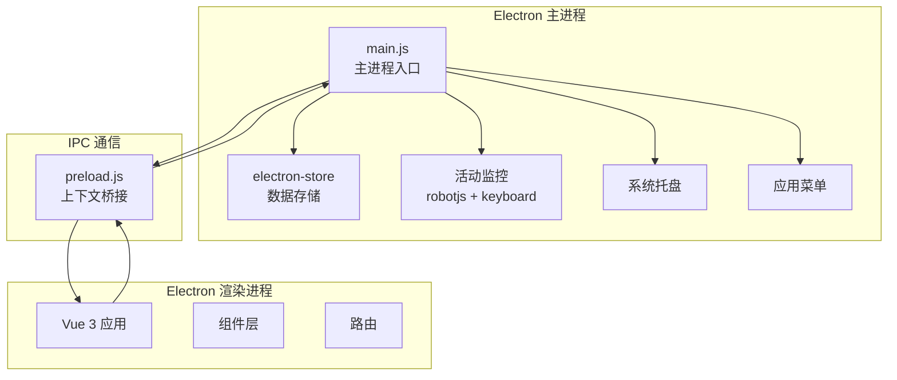
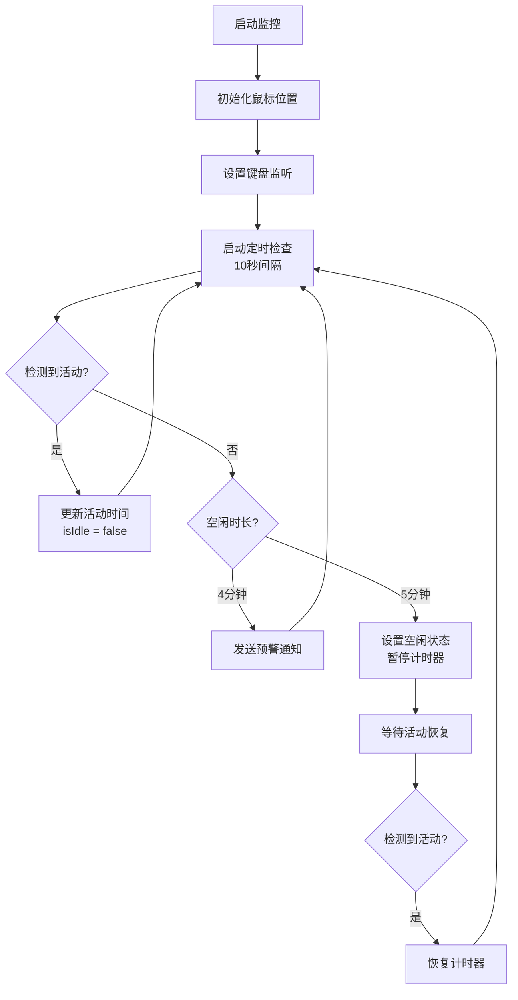

# TodoPomo 技术架构文档

## 1. 架构概览

### 1.1 整体架构
TodoPomo 采用 **Electron + Vue 3** 的桌面应用架构，结合了 Web 技术的灵活性和桌面应用的原生能力。



### 1.2 技术选型理由

| 技术 | 选择理由 |
|------|---------|
| **Electron** | 跨平台桌面应用开发，访问系统级API |
| **Vue 3** | 现代化响应式框架，Composition API 提高代码组织性 |
| **Vite** | 快速的开发服务器，优秀的构建性能 |
| **electron-store** | 简单可靠的本地数据持久化方案 |
| **robotjs** | 系统级鼠标键盘监控能力 |
| **node-global-key-listener** | 全局键盘事件监听 |

## 2. 项目结构

### 2.1 目录结构

```
TodoPomo/
├── electron/                    # Electron 主进程代码
│   ├── main.js                 # 主进程入口，核心逻辑
│   ├── preload.js              # 预加载脚本，IPC桥接
│   ├── menu.js                 # 应用菜单和设置管理
│   ├── reminder.html           # 休息提醒页面（窗口模式）
│   ├── reminder-full-screen.html  # 休息提醒页面（全屏模式）
│   ├── notification.html       # 系统通知页面
│   ├── devicepicker.html       # 蓝牙设备选择页面
│   ├── devicepicker.js         # 蓝牙设备选择逻辑
│   ├── utils/                  # 工具函数
│   │   └── notification.js     # 系统通知工具
│   └── assets/                 # 资源文件
│       ├── icon.png            # 应用图标
│       ├── break-start-new.wav # 休息开始音效
│       └── break-end.wav       # 休息结束音效
│
├── src/                        # Vue 渲染进程代码
│   ├── App.vue                 # 根组件
│   ├── main.js                 # Vue 应用入口
│   ├── components/             # Vue 组件
│   │   ├── TodoPomodoro.vue   # 主组件（核心业务逻辑）
│   │   ├── FocusHistory.vue   # 专注历史组件
│   │   ├── FocusHistoryModal.vue  # 历史记录弹窗
│   │   ├── TaskEditModal.vue  # 任务编辑弹窗
│   │   ├── ImportTaskModal.vue # 任务导入弹窗
│   │   ├── Device.vue          # 蓝牙设备组件
│   │   └── icons/              # 图标组件
│   ├── assets/                 # 样式和资源
│   └── router/                 # 路由配置（预留）
│
├── build/                      # 构建资源
│   └── icon.ico               # Windows 图标
│
├── dist/                       # 构建输出目录
├── public/                     # 公共静态资源
├── package.json               # 项目配置
├── vite.config.js             # Vite 构建配置
└── README.md                  # 项目说明
```

### 2.2 核心文件说明

#### 主进程核心文件
- **main.js** (997行)：主进程核心，包含窗口管理、活动监控、数据存储、IPC处理
- **preload.js** (65行)：安全的IPC通信桥接
- **menu.js** (10277字节)：应用菜单和配置管理

#### 渲染进程核心文件
- **TodoPomodoro.vue** (1601行)：主组件，包含计时器、任务管理、历史记录等核心逻辑
- **App.vue** (62行)：根组件，全局样式定义

## 3. 技术栈详解

### 3.1 前端技术栈

#### 3.1.1 Vue 3 生态
```json
{
  "vue": "^3.5.13",
  "vue-router": "^4.5.0"
}
```

**核心特性使用**：
- **Composition API**：使用 `<script setup>` 语法
- **响应式系统**：`ref`、`computed`、`watch`
- **生命周期钩子**：`onMounted`、`onUnmounted`
- **异步组件**：`defineAsyncComponent` 优化加载

**示例代码**：
```javascript
// 响应式状态管理
const timeLeft = ref(FOCUS_TIME.value)
const isRunning = ref(false)

// 计算属性
const progressOffset = computed(() => {
  const progress = timeLeft.value / FOCUS_TIME.value
  return circumference.value * (1 - progress)
})

// 监听器
watch(timeLeftMinutes, (newVal, oldVal) => {
  if (oldVal > newVal && oldVal !== FOCUS_TIME.value/60) {
    totalFocusTime.value++
  }
})
```

#### 3.1.2 构建工具 - Vite
```javascript
// vite.config.js
export default defineConfig({
  base: './',
  server: { port: 3002 },
  plugins: [vue(), vueDevTools()],
  resolve: {
    alias: { '@': fileURLToPath(new URL('./src', import.meta.url)) }
  }
})
```

**优势**：
- 极速的热模块替换（HMR）
- 基于 ESM 的开发服务器
- 优化的生产构建

### 3.2 Electron 技术栈

#### 3.2.1 核心依赖
```json
{
  "electron": "^35.7.5",
  "electron-store": "^4.0.0",
  "electron-builder": "^26.0.12"
}
```

#### 3.2.2 进程架构

**主进程职责**：
- 创建和管理窗口
- 处理系统级事件（锁屏、唤醒）
- 用户活动监控
- 数据持久化
- 系统托盘管理

**渲染进程职责**：
- UI 渲染和用户交互
- 业务逻辑处理
- 状态管理

**IPC 通信机制**：
```javascript
// preload.js - 安全的上下文桥接
contextBridge.exposeInMainWorld('electronAPI', {
  addTask: (task) => ipcRenderer.invoke('add-task', task),
  onSystemIdle: (callback) => ipcRenderer.on('system-idle', callback)
})

// 渲染进程调用
await window.electronAPI.addTask(task)

// 主进程处理
ipcMain.handle('add-task', (event, task) => {
  // 处理逻辑
  return task
})
```

### 3.3 系统级功能依赖

#### 3.3.1 活动监控
```json
{
  "robotjs": "^0.6.0",
  "node-global-key-listener": "^0.3.0"
}
```

**实现原理**：
```javascript
// 鼠标活动检测
function checkUserActivity() {
  const currentMousePos = robot.getMousePos()
  const hasMouseMoved = 
    Math.abs(currentMousePos.x - lastMousePosition.x) > 3 ||
    Math.abs(currentMousePos.y - lastMousePosition.y) > 3
  
  if (hasMouseMoved) {
    updateLastActivity()
  } else if (idleTime > 5 * 60 * 1000) {
    isIdle = true
    mainWindow?.webContents.send('system-idle', true)
  }
}

// 键盘活动监听
const keyboard = new GlobalKeyboardListener()
keyboard.addListener(function(e) {
  updateLastActivity()
})
```

#### 3.3.2 数据持久化
```javascript
// electron-store 配置
const store = new Store({
  name: 'todo-pomodoro',
  defaults: {
    dailyRecords: {
      // '2024-01-20': {
      //   tasks: [],
      //   totalFocusTime: 0,
      //   focusHistory: []
      // }
    }
  }
})
```

**数据结构**：
```typescript
interface DailyRecord {
  tasks: Task[]
  totalFocusTime: number
  focusHistory: FocusRecord[]
}

interface Task {
  id: number
  text: string
  completed: boolean
  totalSegments: number
  completedTime: number
  totalTime: number
}

interface FocusRecord {
  date: string
  taskId: string
  taskName: string
  startTime: string
  endTime: string
  duration: number
}
```

## 4. 核心功能实现

### 4.1 番茄计时器

#### 4.1.1 计时器核心逻辑
```javascript
// 计时器状态
const timeLeft = ref(FOCUS_TIME.value)      // 剩余时间
const isStart = ref(false)                  // 是否开始
const isPause = ref(false)                  // 用户暂停
const isRunning = ref(false)                // 正在运行
const timer = ref(null)                     // 定时器实例

// 开始计时
const startTimer = () => {
  if (!isRunning.value) {
    focusStartTime.value = new Date()
    isRunning.value = true
    isStart.value = true
    isPause.value = false
    
    timer.value = setInterval(() => {
      if (timeLeft.value > 0) {
        timeLeft.value--
        checkShortBreak()  // 检查短休息
      } else {
        handleTimerComplete()  // 处理完成
      }
    }, 1000)
  }
}

// 暂停计时
const pauseTimer = (needCleanupActivity = true) => {
  clearInterval(timer.value)
  isRunning.value = false
  window.electronAPI.updateTimerStatus(false, needCleanupActivity)
}

// 重置计时
const resetTimer = async (isIdle = false) => {
  pauseTimer(false)
  if (focusStartTime.value) {
    await saveToStorage(isIdle, currentTask.value)
  }
  focusStartTime.value = null
  timeLeft.value = FOCUS_TIME.value
  isStart.value = false
}
```

#### 4.1.2 进度可视化
```javascript
// SVG 环形进度条
const radius = 145
const circumference = computed(() => 2 * Math.PI * radius)

const progressOffset = computed(() => {
  const progress = timeLeft.value / FOCUS_TIME.value
  return circumference.value * (1 - progress)
})
```

```vue
<svg class="progress-ring" width="320" height="320">
  <circle
    class="progress-ring__circle"
    stroke="var(--primary-color)"
    stroke-width="15"
    :style="{
      strokeDasharray: `${circumference} ${circumference}`,
      strokeDashoffset: progressOffset
    }"
  />
</svg>
```

### 4.2 活动监控系统

#### 4.2.1 监控流程


#### 4.2.2 系统事件处理
```javascript
// 屏幕锁定
powerMonitor.on('lock-screen', () => {
  isIdle = true
  mainWindow?.webContents.send('system-idle', true, 'lock-screen')
  cleanupActivityMonitoring()
})

// 屏幕解锁
powerMonitor.on('unlock-screen', () => {
  setupActivityMonitoring()
  mainWindow?.webContents.send('refresh-data')
})
```

### 4.3 休息提醒系统

#### 4.3.1 多屏幕支持
```javascript
function createReminderWindow(text, duration, breakType) {
  const displays = screen.getAllDisplays()
  reminderWindows = []
  
  displays.forEach((display) => {
    const { bounds } = display
    const reminderWindow = new BrowserWindow({
      width: bounds.width,
      height: bounds.height,
      x: bounds.x,
      y: bounds.y,
      frame: false,
      alwaysOnTop: true,
      backgroundColor: breakType === 'long' ? '#ffffff' : '#00f2ea'
    })
    
    reminderWindow.loadFile('reminder.html')
    reminderWindows.push(reminderWindow)
  })
  
  // 定时关闭
  reminderTimer = setTimeout(() => {
    reminderWindows.forEach(w => w.close())
    setupActivityMonitoring()
  }, duration * 1000 + 4000)
}
```

#### 4.3.2 全屏强制模式
```javascript
if (fullScreen) {
  reminderWindow.setMinimizable(false)
  reminderWindow.setMaximizable(false)
  reminderWindow.setResizable(false)
  reminderWindow.setFullScreen(true)
  reminderWindow.setAlwaysOnTop(true, 'screen-saver')
  
  // 防止失去焦点
  reminderWindow.on('blur', () => {
    reminderWindow.focus()
  })
}
```

### 4.4 数据管理

#### 4.4.1 专注记录保存
```javascript
const saveToStorage = async (isIdle = false, task) => {
  // 计算结束时间（空闲时减去5分钟）
  const endTime = new Date(isIdle ? Date.now() - 1000 * 60 * 5 : Date.now())
  
  const duration = 
    endTime.getHours() * 60 + endTime.getMinutes() -
    focusStartTime.value.getHours() * 60 - focusStartTime.value.getMinutes()
  
  // 过滤短时专注（<5分钟）
  if ((duration <= 4 && task && task.totalTime - task.completedTime <= 4) || 
      duration > 4) {
    await window.electronAPI.addFocusRecord({
      date: endTime.toISOString().split('T')[0],
      taskId: task?.id || '',
      taskName: task?.text || '专注',
      startTime: formatTime(focusStartTime.value),
      endTime: formatTime(endTime),
      duration: duration
    })
  }
  
  // 更新任务完成时间
  if (task) {
    await window.electronAPI.updateTask({...task})
  }
}
```

#### 4.4.2 任务时间追踪
```javascript
// 监听分钟数变化
watch(timeLeftMinutes, (newVal, oldVal) => {
  if (oldVal > newVal && oldVal !== FOCUS_TIME.value/60) {
    totalFocusTime.value++  // 增加总专注时间
    
    if (currentTask.value) {
      const curTask = tasks.value.find(t => t.id === currentTask.value.id)
      if (curTask.completedTime < curTask.totalTime) {
        curTask.completedTime++  // 增加任务完成时间
      }
      
      // 到时提醒
      if (curTask.completedTime === curTask.totalTime - 15) {
        window.electronAPI.showNotification({
          title: '任务即将到时',
          body: `距离任务到时还有15分钟`
        })
      }
    }
  }
})
```

## 5. 构建和部署

### 5.1 开发环境

#### 5.1.1 启动开发服务器
```json
{
  "scripts": {
    "dev": "vite",
    "electron-dev": "cross-env NODE_ENV=development electron .",
    "start": "concurrently \"vite\" \"ping 127.0.0.1 -n 3 >nul && cross-env NODE_ENV=development electron .\""
  }
}
```

**流程**：
1. Vite 启动开发服务器（端口3002）
2. 等待3秒（ping命令）
3. 启动 Electron 主进程
4. 主进程加载 `http://localhost:3002`

#### 5.1.2 环境判断
```javascript
if (process.env.NODE_ENV === 'development') {
  mainWindow.loadURL("http://localhost:3002")
} else {
  mainWindow.loadURL(`file://${path.join(__dirname, "../dist/index.html")}`)
}
```

### 5.2 生产构建

#### 5.2.1 构建配置
```json
{
  "build": {
    "appId": "com.anakin.todo-pomo",
    "productName": "TodoPomo",
    "files": ["dist/**/*", "electron/**/*"],
    "directories": { "output": "app_client" },
    "win": {
      "icon": "build/icon.ico",
      "target": [{"target": "nsis", "arch": ["x64", "ia32"]}]
    },
    "nsis": {
      "oneClick": false,
      "allowToChangeInstallationDirectory": true
    }
  }
}
```

#### 5.2.2 构建流程
```bash
# 1. 构建 Vue 应用
npm run build

# 2. 打包 Electron 应用
npm run electron:build
```

**输出**：
- `dist/` - Vue 构建产物
- `app_client/` - Electron 安装包
  - `TodoPomo Setup 1.0.0.exe` - Windows 安装程序
  - `win-unpacked/` - 未打包的应用文件

### 5.3 依赖重建

某些原生模块需要针对 Electron 重新编译：
```json
{
  "scripts": {
    "postinstall": "electron-builder install-app-deps",
    "rebuild": "./node_modules/.bin/electron-rebuild"
  }
}
```

## 6. 性能优化

### 6.1 已实施的优化

#### 6.1.1 防止后台节流
```javascript
// 保持应用活跃
app.commandLine.appendSwitch('disable-background-timer-throttling')
app.commandLine.appendSwitch('disable-background-networking')

// 窗口配置
webPreferences: {
  backgroundThrottling: false
}
```

#### 6.1.2 异步组件加载
```javascript
const FocusHistoryModal = defineAsyncComponent(() => 
  import('./FocusHistoryModal.vue')
)
```

#### 6.1.3 通知节流
```javascript
const IDLE_WARNING_COOLDOWN = 20 * 1000  // 20秒冷却
let lastIdleWarningTime = 0

if (currentTime - lastIdleWarningTime > IDLE_WARNING_COOLDOWN) {
  systemNotify('即将进入空闲状态！')
  lastIdleWarningTime = currentTime
}
```

### 6.2 潜在优化方向

- **虚拟滚动**：任务列表和历史记录使用虚拟滚动
- **Web Worker**：将活动检测移至 Worker 线程
- **数据分页**：历史记录按月分页加载
- **缓存策略**：缓存常用数据，减少 IPC 调用

## 7. 安全性

### 7.1 上下文隔离
```javascript
webPreferences: {
  preload: path.join(__dirname, 'preload.js'),
  contextIsolation: true,      // 启用上下文隔离
  nodeIntegration: false,      // 禁用 Node 集成
  devTools: false              // 生产环境禁用开发工具
}
```

### 7.2 IPC 安全
- 使用 `contextBridge` 暴露有限的 API
- 主进程验证所有输入
- 不直接暴露文件系统访问

## 8. 测试策略

### 8.1 当前测试覆盖
- ✅ 手动功能测试
- ✅ 用户验收测试
- ❌ 单元测试（未实施）
- ❌ 集成测试（未实施）
- ❌ E2E测试（未实施）

### 8.2 建议测试方案
- **单元测试**：Jest + Vue Test Utils
- **E2E测试**：Spectron / Playwright
- **性能测试**：Lighthouse / Chrome DevTools

## 9. 技术债务和改进建议

### 9.1 代码质量
- **TodoPomodoro.vue 过大**：1601行，建议拆分为多个组件
- **类型安全**：考虑迁移到 TypeScript
- **错误处理**：增加全局错误捕获和上报

### 9.2 架构改进
- **状态管理**：引入 Pinia 统一状态管理
- **路由系统**：完善 Vue Router 配置
- **模块化**：将业务逻辑抽取为可复用的 Composables

### 9.3 功能增强
- **数据导出**：支持导出为 CSV/JSON
- **云同步**：支持多设备数据同步
- **主题系统**：支持浅色/深色主题切换
- **插件系统**：支持第三方扩展

## 10. 依赖管理

### 10.1 核心依赖版本
```json
{
  "dependencies": {
    "vue": "^3.5.13",
    "electron": "^35.7.5",
    "electron-store": "^4.0.0",
    "robotjs": "^0.6.0",
    "node-global-key-listener": "^0.3.0"
  },
  "devDependencies": {
    "vite": "^6.2.1",
    "@vitejs/plugin-vue": "^5.2.1",
    "electron-builder": "^26.0.12"
  }
}
```

### 10.2 依赖更新策略
- **主版本更新**：需要充分测试
- **次版本更新**：定期更新，关注 Breaking Changes
- **补丁更新**：及时更新，修复安全漏洞

---

**文档版本**：v1.0  
**最后更新**：2025-11-22  
**维护者**：Anakin  
**技术栈版本**：Electron 35.7.5 + Vue 3.5.13 + Vite 6.2.1
